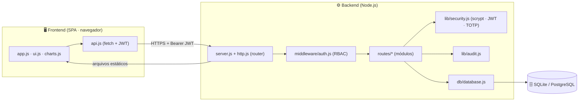

# 🏗️ Arquitetura — MetroControl

## 1. Visão geral

MetroControl é uma aplicação web **cliente-servidor** em três camadas, com
backend e frontend desacoplados por uma **API REST**.



## 2. Princípios de design

| Princípio | Como é aplicado |
|-----------|-----------------|
| **Zero dependências** | Backend usa apenas `node:http`, `node:sqlite`, `node:crypto`. Frontend usa JS/CSS puros. Sem build, sem bundler. |
| **Separação de responsabilidades** | `lib/` (infra), `middleware/` (transversal), `routes/` (regras de negócio por módulo), `db/` (persistência). |
| **Acesso a dados isolado** | Toda query passa por `db/database.js` (`all/get/run/transaction`) — trocar SQLite por PostgreSQL afeta **um** arquivo. |
| **Segurança por padrão** | Autenticação obrigatória, RBAC, hash forte, 2FA, auditoria, soft-delete. |
| **Rastreabilidade** | Auditoria temporal + trilha de eventos + snapshots JSON antes/depois. |

## 3. Camadas

### 3.1 Frontend (SPA)
- **`app.js`** — orquestra login, shell (sidebar/topbar), roteamento por hash e
  todas as telas dos módulos.
- **`api.js`** — cliente REST: injeta o token JWT, trata expiração (401 → logout),
  faz downloads autenticados.
- **`ui.js`** — biblioteca de UI: ícones SVG, toasts, modais, confirmação com
  dupla validação, formatação (datas/moeda) e badges de status.
- **`charts.js`** — gráficos (rosca/barras/linha) renderizados em **SVG puro**.

### 3.2 Backend
- **`server.js`** — ponto de entrada: inicializa o schema, popula o seed na 1ª
  execução, monta o roteador, sobe o HTTP e serve a SPA.
- **`lib/http.js`** — micro-framework: roteamento com parâmetros (`:id`), parsing
  de JSON/query, respostas auxiliares, servidor de estáticos (com proteção a path traversal).
- **`middleware/auth.js`** — `autenticar` (valida JWT e recarrega o usuário),
  `exigirPerfil` (hierarquia RBAC), `exigirEscrita` (bloqueia perfis somente-leitura).
- **`routes/*`** — um arquivo por módulo, cada um exportando `register(router)`.

### 3.3 Persistência
- **`db/schema.sql`** — schema declarativo (tabelas, FKs, índices, views).
- **`db/database.js`** — conexão e helpers; ponto único de troca de SGBD.
- **`db/seed.js`** — dados de demonstração realistas com datas relativas.

## 4. Segurança (detalhe)

| Mecanismo | Implementação |
|-----------|---------------|
| **Hash de senha** | `scrypt` (node:crypto) com salt aleatório por usuário; comparação em tempo constante. |
| **Sessão** | **JWT HS256** assinado com `JWT_SECRET`, expiração de 8 h, validado a cada request. |
| **2FA** | **TOTP RFC 6238** (HMAC-SHA1, janela ±30 s), compatível com Google Authenticator/Authy. |
| **RBAC** | 2 perfis hierárquicos (Controle de Padrões, Administrador); verificação no servidor (e ocultação no cliente). |
| **Anti-força-bruta** | Contador de tentativas + bloqueio temporário de 15 min. |
| **Auditoria** | Toda ação relevante grava usuário, IP, user-agent e snapshots. |
| **Proteção de dados** | Exclusão lógica + dupla confirmação + motivo + lixeira + restauração. |
| **CORS / headers** | Configurável por `CORS_ORIGIN`. |

## 5. Fluxo de uma requisição

```
1. Navegador → fetch('/api/padroes', Authorization: Bearer <jwt>)
2. server.js  → identifica /api/ → router.match(method, path)
3. handler    → autenticar(ctx)  (valida JWT, carrega usuário)
              → exigirEscrita/exigirPerfil (RBAC)  [se necessário]
4. regra de negócio → db.all/get/run (+ transaction)
5. registrarAuditoria(...)  [em ações de escrita]
6. resposta JSON  →  navegador atualiza a tela
```

## 6. Escalabilidade e evolução

- **Banco:** SQLite (single-node) → PostgreSQL gerenciado para múltiplas
  instâncias e backups automáticos (ver [HOSPEDAGEM.md](HOSPEDAGEM.md)).
- **Anexos:** hoje referenciados por nome; em produção, integrar a um bucket
  (S3/Supabase Storage) preenchendo `anexos.nome_arquivo` com a chave do objeto.
- **E-mail de alertas:** o endpoint `/api/alertas` já fornece os dados; basta
  acoplar um worker (cron) que consulta vencimentos e dispara e-mails (SMTP/Resend).
- **Stateless:** como a sessão é JWT, o backend é stateless e escala horizontalmente.

## 7. Tecnologias

| Camada | Tecnologia |
|--------|-----------|
| Runtime | Node.js ≥ 22.5 |
| Banco | SQLite (`node:sqlite`) / PostgreSQL |
| Auth | JWT + scrypt + TOTP (`node:crypto`) |
| Frontend | HTML5, CSS3 (custom properties), JavaScript ES Modules |
| Gráficos | SVG nativo |
| QR | API de imagem + `html5-qrcode` (scanner) |
