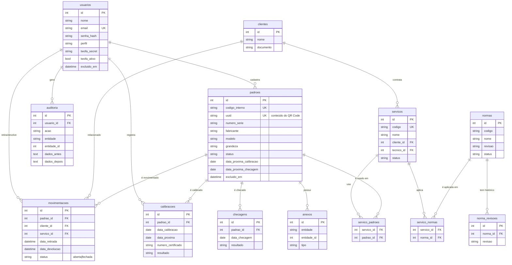

# 🗄️ Banco de Dados — MetroControl

Este documento descreve o **diagrama ER**, a **estrutura das tabelas**, os
**índices** e as regras de **integridade referencial** do MetroControl.

- **SGBD de desenvolvimento:** SQLite (módulo nativo `node:sqlite`).
- **SGBD recomendado para produção:** PostgreSQL gerenciado (ver [HOSPEDAGEM.md](HOSPEDAGEM.md)).
- **Arquivo do schema:** [`backend/src/db/schema.sql`](../backend/src/db/schema.sql).

---

## 1. Diagrama Entidade-Relacionamento (ER)



> 💡 O bloco acima é **Mermaid** — renderiza automaticamente no GitHub, GitLab,
> VS Code (extensão Markdown Preview Mermaid) ou em <https://mermaid.live>.

---

## 2. Visão geral das tabelas

| Tabela | Função | Soft-delete? |
|--------|--------|:---:|
| `usuarios` | Contas, perfis (RBAC), 2FA, bloqueio por tentativas | ✅ |
| `clientes` | Clientes relacionados a movimentações e serviços | ✅ |
| `padroes` | **Entidade central** — padrões de medição | ✅ |
| `anexos` | Certificados, fotos e PDFs (genérico por entidade) | ✅ |
| `movimentacoes` | Retiradas e devoluções (rastreamento) | ✅ |
| `calibracoes` | Histórico de calibrações | ✅ |
| `checagens` | Histórico de checagens intermediárias | ✅ |
| `normas` | Biblioteca de normas técnicas | ✅ |
| `norma_revisoes` | Versionamento de revisões das normas | — |
| `servicos` | Serviços metrológicos | ✅ |
| `servico_padroes` | Junção serviço ↔ padrões (N:N) | — |
| `servico_normas` | Junção serviço ↔ normas (N:N) | — |
| `auditoria` | Trilha permanente de ações (nunca excluída) | — |
| `configuracoes` | Parâmetros do sistema (chave/valor) | — |

---

## 3. Padrões de projeto aplicados

### 3.1 Auditoria temporal (em toda tabela de negócio)
```sql
criado_em       TEXT NOT NULL DEFAULT (datetime('now')),
atualizado_em   TEXT NOT NULL DEFAULT (datetime('now')),
criado_por      INTEGER REFERENCES usuarios(id),
atualizado_por  INTEGER REFERENCES usuarios(id),
```

### 3.2 Exclusão lógica (soft delete) — **nunca apaga fisicamente**
```sql
excluido_em     TEXT,                       -- NULL = registro ativo
excluido_por    INTEGER REFERENCES usuarios(id),
motivo_exclusao TEXT,                        -- exigência de auditoria
```
Toda consulta de leitura filtra `WHERE excluido_em IS NULL`. A **lixeira** lista
`WHERE excluido_em IS NOT NULL`, e a **restauração** seta `excluido_em = NULL`.

### 3.3 Versionamento (snapshots em JSON)
A tabela `auditoria` grava `dados_antes` e `dados_depois` (JSON) a cada edição,
permitindo reconstruir o histórico de qualquer registro.

### 3.4 QR Code estável
Cada padrão recebe um `uuid` único e imutável no cadastro. O QR Code codifica
`https://<host>/#/q/<uuid>`, e o endpoint `GET /api/padroes/uuid/:uuid` resolve
o padrão correspondente — escanear abre a ficha diretamente.

---

## 4. Estrutura detalhada — tabela `padroes` (central)

| Coluna | Tipo | Descrição |
|--------|------|-----------|
| `id` | INTEGER PK | Identificador interno |
| `codigo_interno` | TEXT **UNIQUE** | Código único da empresa |
| `numero_serie` | TEXT | Número de série do fabricante |
| `fabricante` / `modelo` | TEXT | Identificação do equipamento |
| `tipo_instrumento` | TEXT | Ex.: paquímetro, balança, manômetro |
| `grandeza` | TEXT | Grandeza medida (massa, comprimento…) |
| `faixa_indicacao` | TEXT | Ex.: "0 a 150 mm" |
| `resolucao` / `exatidao` | TEXT | Características metrológicas |
| `classe_metrologica` | TEXT | Classe/grau |
| `localizacao` / `setor` | TEXT | Localização física |
| `mapa_x` / `mapa_y` | REAL | Coordenadas no mapa de localização |
| `data_aquisicao` | TEXT | Data de aquisição |
| `data_ultima_calibracao` | TEXT | Última calibração |
| `data_proxima_calibracao` | TEXT | **Próxima calibração** (indexada) |
| `data_ultima_checagem` | TEXT | Última checagem |
| `data_proxima_checagem` | TEXT | **Próxima checagem** (indexada) |
| `periodicidade_calibracao_meses` | INTEGER | Intervalo p/ cálculo automático |
| `periodicidade_checagem_meses` | INTEGER | Intervalo p/ cálculo automático |
| `status` | TEXT | `disponivel`, `em_uso`, `em_manutencao`, `fora_operacao`, `inativo` |
| `uuid` | TEXT **UNIQUE** | Conteúdo do QR Code |
| *(auditoria + soft-delete)* | | colunas das seções 3.1 e 3.2 |

---

## 5. Índices (performance)

Índices criados para acelerar buscas e filtros frequentes:

```sql
-- Padrões
idx_padroes_codigo, idx_padroes_status, idx_padroes_grandeza,
idx_padroes_prox_cal, idx_padroes_prox_chk, idx_padroes_uuid, idx_padroes_excluido
-- Relacionamentos
idx_mov_padrao, idx_mov_status, idx_mov_cliente,
idx_cal_padrao, idx_cal_data, idx_chk_padrao
-- Auditoria
idx_audit_usuario, idx_audit_entidade, idx_audit_data, idx_audit_acao
-- Usuários / Normas
idx_usuarios_email, idx_usuarios_perfil, idx_normas_codigo
```

---

## 6. Integridade referencial

- `PRAGMA foreign_keys = ON` — chaves estrangeiras **aplicadas** em todas as relações.
- Exclusões são lógicas, então **não há `ON DELETE CASCADE`**: os relacionamentos
  são preservados para manter o histórico (rastreabilidade permanente).
- Campos redundantes propositais (`retirado_por_nome`, `cliente_nome`,
  `tecnico_nome`) congelam o "estado da época" mesmo que o registro-pai mude.

---

## 7. View de apoio

```sql
CREATE VIEW vw_padroes_vencimento AS
SELECT p.*,
  CAST(julianday(p.data_proxima_calibracao) - julianday(date('now')) AS INTEGER) AS dias_para_calibracao,
  CAST(julianday(p.data_proxima_checagem)   - julianday(date('now')) AS INTEGER) AS dias_para_checagem
FROM padroes p
WHERE p.excluido_em IS NULL;
```

Facilita relatórios e o painel de vencimentos calculando os dias restantes
diretamente no banco.
